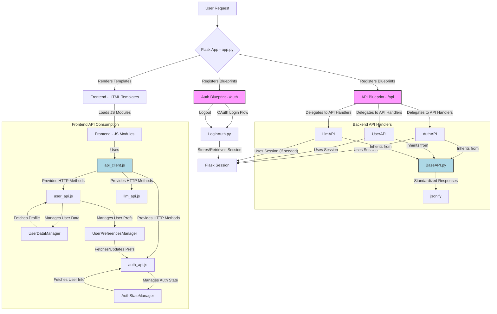

# EasyLesson Web Application Documentation

This document provides a detailed overview of the EasyLesson web application's workflow, file structure, API design, and conventions.

## 1. Application Workflow and File Connection

The EasyLesson application is built using Flask for the backend and a combination of HTML, CSS, and JavaScript for the frontend. The `docker-compose.yml` orchestrates the services, and the `Dockerfile` builds the Flask application image.

### 1.1. High-Level Architecture Diagram



### 1.2. Backend Workflow (`app.py`, `backend/loginauth`, `backend/api_routes`)

1.  **`app.py`**:
    *   This is the main application factory. It initializes the Flask app, loads configurations (including `AuthConfig`), and registers various blueprints.
    *   It defines core routes like `/` (home page) and `/easylesson` (main application interface), which require authentication.
    *   `HomeRoutes.index()` now retrieves user information from the session and passes it to `home.html` for conditional rendering of UI elements.

2.  **Authentication Flow (`backend/loginauth/LoginAuth.py`, `backend/loginauth/AuthConfig.py`)**:
    *   `AuthConfig.py` stores sensitive configuration (like Google OAuth client ID/secret) and sets `SESSION_PERMANENT = True` for persistent logins.
    *   `LoginAuth.py` handles the Google OAuth 2.0 flow.
    *   The `/auth/login` route initiates the Google login, redirecting the user to Google's authentication server.
    *   The `/auth/callback` route receives the response from Google, verifies the ID token, extracts user details, and stores them in the Flask `session`.
    *   `login_required` decorator ensures that certain routes (e.g., `/easylesson`) are only accessible to authenticated users.
    *   `/auth/logout` clears the user's session and redirects them to the home page.

3.  **API Routes (`backend/api_routes.py`)**:
    *   The `api_bp` Blueprint (prefixed with `/api`) centralizes all backend API route definitions.
    *   It imports specific API handler classes (e.g., `AuthAPI`, `UserAPI`, `LlmAPI`) and defines Flask view functions that call methods from these handlers.
    *   `api_bp.add_url_rule()` is used to map specific URL paths to these view functions and HTTP methods (e.g., GET, POST, PUT).

### 1.3. Frontend Workflow (`frontend/templates`, `frontend/static/api`, `frontend/static/home`)

1.  **HTML Templates (`frontend/templates/home.html`)**:
    *   `home.html` is the landing page. It conditionally displays a "Welcome, [first_name]!" message (which links to `/easylesson`) and a "Logout" button if the user is authenticated, or "Continue with Google" buttons if not.
    *   `easylesson.html` is the main application page and has been reverted to its original state as per the user's request.

2.  **JavaScript API Modules (`frontend/static/api/`)**:
    *   **`api_client.js`**: Provides a robust `APIClient` for making HTTP requests (GET, POST, PUT, DELETE) to the backend `/api` endpoints. It also includes `APIError` for standardized error handling and `ResponseHandler` for displaying user notifications.
    *   **`auth_api.js`**: Contains `AuthAPI` for authentication-related calls (e.g., `checkAuthStatus`, `getUserInfo`). `AuthStateManager` manages the client-side authentication state, fetching user info and notifying components of changes.
    *   **`user_api.js`**: Includes `UserAPI` for user-specific data (e.g., `getProfile`, `updateProfile`). `UserDataManager` and `UserPreferencesManager` handle client-side caching and management of user data and preferences.
    *   **`llm_api.js`**: Contains `llmAPI` for interacting with the Large Language Model backend (e.g., `getAvailableModels`, `sendMessageToLLM`).

3.  **CSS Styling (`frontend/static/home/home.css`)**:
    *   `home.css` defines styles for the `home.html` page, including the `welcome-message-box` (blue background, no underline) and `logout-button` (white background with blue border).

## 2. API Design and Conventions

The API follows a structured and consistent approach across the backend and frontend.

### 2.1. Backend API Conventions

*   **Base API (`backend/api/base_api.py`)**:
    *   All API handler classes (e.g., `AuthAPI`, `UserAPI`, `LlmAPI`) inherit from `BaseAPI`.
    *   Provides standard methods for:
        *   `success_response(data, message, status_code)`: For successful JSON responses.
        *   `error_response(message, status_code, error_code, details)`: For error JSON responses.
        *   `handle_exception(e, default_message)`: Centralized exception handling.
        *   `validate_required_fields(data, required_fields)`: Input validation.
        *   `sanitize_user_data(user_data)`: To remove sensitive information from user data before sending it to the frontend.
*   **Module-Based Organization**:
    *   API endpoints are grouped into logical modules (e.g., `auth_api.py` for authentication, `user_api.py` for user profiles, `llm_api.py` for LLM interactions).
*   **Flask Blueprint (`backend/api_routes.py`)**:
    *   A `Blueprint` (`api_bp`) with a `/api` prefix is used to manage all API routes. This allows for modularity and clear separation from other application routes.
    *   Routes are registered using `api_bp.add_url_rule()`, specifying the URL path, endpoint name, view function, and allowed HTTP methods (e.g., `GET`, `POST`, `PUT`).
*   **Authentication**:
    *   API endpoints that require authentication typically check the Flask `session` for a `user` object, often using `AuthService.get_current_user()`. If not authenticated, they return a 401 Unauthorized error.
*   **Response Format**:
    *   All API responses are JSON objects with a `success` boolean, a `message`, and either `data` (on success) or `error_code` and `details` (on error).
    *   Example Success: `{"success": true, "message": "User information retrieved successfully", "data": {"user": {...}}}`
    *   Example Error: `{"success": false, "message": "Authentication required", "error_code": "AUTH_REQUIRED"}`

### 2.2. Frontend API Consumption Conventions

*   **Centralized API Client (`frontend/static/api/api_client.js`)**:
    *   The `APIClient` class acts as the single point of contact for all backend API calls.
    *   It handles HTTP methods (`get`, `post`, `put`, `delete`), setting default headers (e.g., `Content-Type: application/json`), and parsing responses.
    *   It includes a custom `APIError` class for consistent error propagation and a `ResponseHandler` for displaying toast notifications (success/error messages).
*   **Module-Based API Services**:
    *   Frontend JavaScript files (e.g., `auth_api.js`, `user_api.js`, `llm_api.js`) define classes or objects that abstract the API calls.
    *   These modules expose simple, asynchronous methods (e.g., `authAPI.getUserInfo()`) that internally use `window.apiClient` to make the actual HTTP requests to the backend.
*   **State Management**:
    *   `AuthStateManager` and `UserDataManager` provide client-side state management for authentication status and user data, including caching mechanisms to reduce redundant API calls.
*   **Global Access**:
    *   Instances of `APIClient`, `AuthAPI`, `AuthStateManager`, `UserAPI`, `UserDataManager`, `UserPreferencesManager` and `llmAPI` are made available globally via the `window` object, allowing any part of the frontend to easily interact with the backend API.

### 2.3. Guideline for Adding New API Features

To add a new API feature, follow these steps:

1.  **Backend - Create/Update API Handler (`backend/api/`)**:
    *   **New Feature**: If it's a new domain (e.g., `lesson_api`), create a new Python file (`lesson_api.py`) within `backend/api/`.
    *   **Existing Domain**: If it extends an existing domain (e.g., new user feature), add methods to the relevant existing API file (e.g., `user_api.py`).
    *   Ensure your new API class inherits from `BaseAPI`.
    *   Define a class method (e.g., `@classmethod def get_lessons(cls):`) that implements the API logic.
    *   Use `cls.success_response()` and `cls.error_response()` for consistent responses.
    *   Utilize `cls.handle_exception()` for error handling.
    *   If input validation is needed, use `cls.validate_required_fields()`.
    *   If user data is involved, sanitize it using `cls.sanitize_user_data()`.

2.  **Backend - Register API Route (`backend/api_routes.py`)**:
    *   Import your new API handler class (e.g., `from backend.api.lesson_api import LessonAPI`).
    *   In the `APIRoutes` class, create a static method that calls your API handler's method (e.g., `staticmethod def lesson_get_all(): return jsonify(LessonAPI.get_lessons())`).
    *   In the `register_api_routes()` function, use `api_bp.add_url_rule()` to register the new route:
        ```python
        api_bp.add_url_rule('/lesson/all', 'lesson_get_all', APIRoutes.lesson_get_all, methods=['GET'])
        ```
    *   Choose an appropriate URL path (e.g., `/lesson/all`), a unique endpoint name (`lesson_get_all`), and the correct HTTP method (`GET`, `POST`, `PUT`, `DELETE`).

3.  **Frontend - Create/Update API Service (`frontend/static/api/`)**:
    *   **New Feature**: If it's a new domain, create a new JavaScript file (e.g., `lesson_api.js`) within `frontend/static/api/`.
    *   **Existing Domain**: If it extends an existing domain, add methods to the relevant existing API service file (e.g., `user_api.js`).
    *   Create a class or object (e.g., `class LessonAPI` or `window.lessonAPI = {}`) that will expose methods for making API calls.
    *   Each method should use `window.apiClient` to make the actual `get`, `post`, `put`, or `delete` requests to your newly defined backend endpoint.
    *   Example:
        ```javascript
        class LessonAPI {
            constructor() {
                this.client = window.apiClient;
                this.baseEndpoint = '/api/lesson';
            }
            async getAllLessons() {
                return await this.client.get(`${this.baseEndpoint}/all`);
            }
        }
        window.lessonAPI = new LessonAPI(); // Make it globally accessible
        ```
    *   Remember to handle potential errors using `try...catch` blocks and `window.ResponseHandler.showErrorMessage()`.

4.  **Frontend - Integrate into HTML/JS**:
    *   If you created a new JavaScript API service file, ensure it's loaded in your HTML templates (e.g., `home.html`) using a `<script>` tag.
    *   In your frontend JavaScript code (e.g., `home.js`), you can now use your new API methods:
        ```javascript
        async function fetchLessons() {
            try {
                const response = await window.lessonAPI.getAllLessons();
                if (response.success) {
                    console.log("Lessons:", response.data);
                }
            } catch (error) {
                console.error("Failed to fetch lessons:", error);
                window.ResponseHandler.showErrorMessage(error);
            }
        }
        fetchLessons();
        ```

This detailed documentation should provide a clear understanding of the codebase and a robust guide for future API development.
